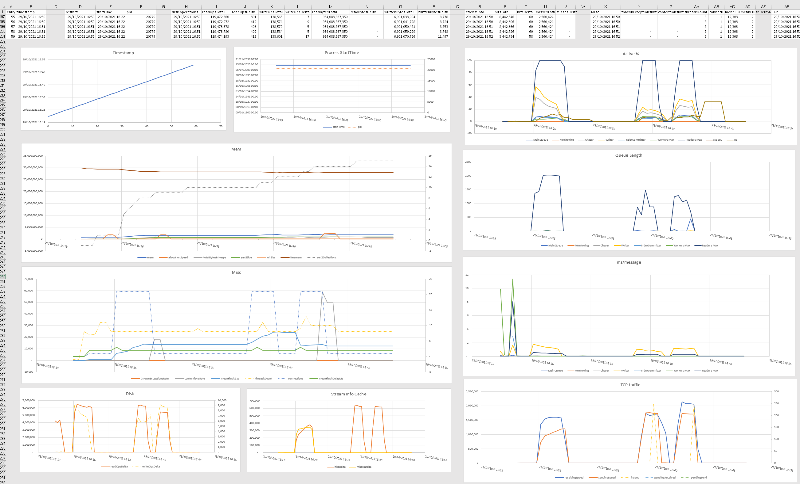

# Esstatic

A command line utility to quickly view EventStore stats files in spreadsheets.

When run, esstatic reads stats files, produces a table of data, and stores it in the clip board. Paste into one of the provided
spreadsheets for instant graphs.

# Features

- samples 200 stats entries across the collection of matching stats files
- select which stats files using the include/exclude glob patterns
- use test mode to output which files match the glob patterns
- use json paths to query the stats entries. aggregate and format.
- skip/take percent entries from the stats files for quick range selection

# Getting started

1. cd to directory

```
PS C:\Users\timot> cd .\Downloads\qa-logs\TestRun1-node-3\
```

2. Run esstatic (provide path to esstatic if it isn't  in your path)

```
PS C:\Users\timot\Downloads\qa-logs\TestRun1-node-3> esstatic

Arguments:
  dir: .
  include: **/*stats*.json
  exclude:
  skip: 0
  take: 100
  test: False

Reading C:\Users\timot\Downloads\qa-logs\TestRun1-node-3\log-stats20211029.json... Done!
Querying... Done!
Copying 109,109 chars to clipboard... Done!
```

3. Paste into cell A1 of the spreadsheet and view results



# TODO

- be able to specify a particular json path on the command line
- be able to specify a different pre-defined set of json paths on the command line
- more predefined json paths
- add license
- file output?
- ...
